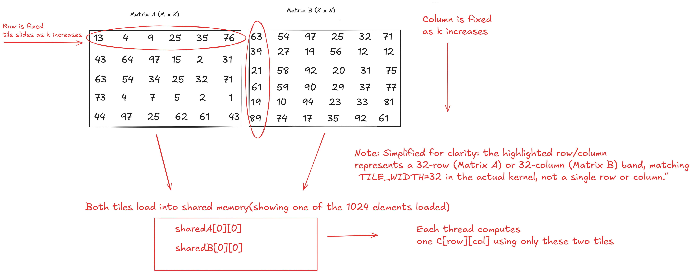

## What is GEMM?

GEMM also known as General Matrix Multiplication computes C = A x B where A is the M x K matrix 
and B is the K x N matrix with the final result being C which is the M x N matrix.This is one of
the most common operations that you will find in deep learning as it relates to every linear layer,
attention projection and fully connected layer. This is also the reason why frameworks such as PyTorch
transfer matrix multiplacation straight to libraries like cuBLAS.

## Why is native GEMM slow on a GPU?

A usual triple nested loop GEMM assigns one output element per
thread. When this happens each thread read one entire row from A and one entire
column from B directly from global memory. While Global Memory is the the biggest form of 
memory on the GPU it is also the slowest. Particularly from the K dimension with size K that is
2 times the K reads from global memory per output meaning thatthreads close to each other read the 
same data from gloabl memory with absouluty no sharing in between.

## Why does tiling matter?

Tiling essentially breaks A and B matrix into small square blocks called tiles that a thread block
loads into shared memory onces and reuses it over and over before moving on to the next tile. This process
trades a huge amount of global memory reads for a small number of slow reads + many fast reads. This becomes 
the main idea for every optimized GEMM kernel including cuBLAS itself.

## Tile size decision: TILE_WIDTH at 32
Benchmarked TILE_WIDTH at 16 vs TILE_WIDTH ar 32 at 2048x2048 using Nsight
Compute (July 24, 2026):

| Metric | TILE=16 | TILE=32 |
|---|---|---|
| Duration (Nsight) | 46.26ms | 41.89ms |
| Achieved occupancy | 99.63% | 99.97% |
| DRAM read bandwidth | 92.49 GB/s | 39.43 GB/s |

TILE_WIDTH at 32 is found to be about 9.4% faster and achieves higher occupancy. The lower DRAM
bandwidth at TILE=32 shows *less total data movement* meaning each element
is reused more times per global load: not reduced throughput capability.
Results have beeen cross-validated with repeated cudaEvent timing after
discovering a cold-start issue on Colab's shared T4 (single-shot runs
ranged 25 to 42ms at this size).

